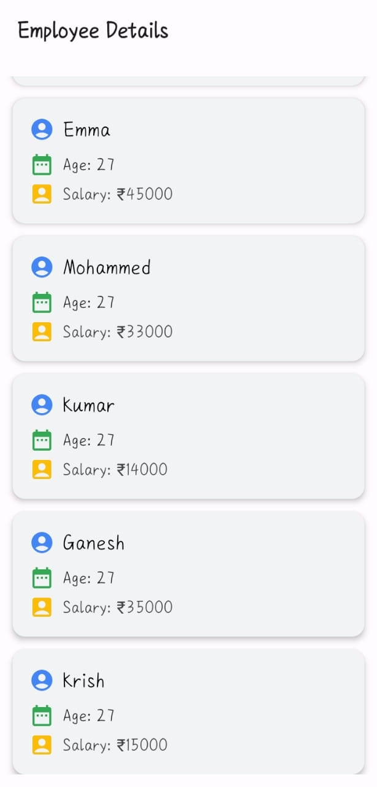
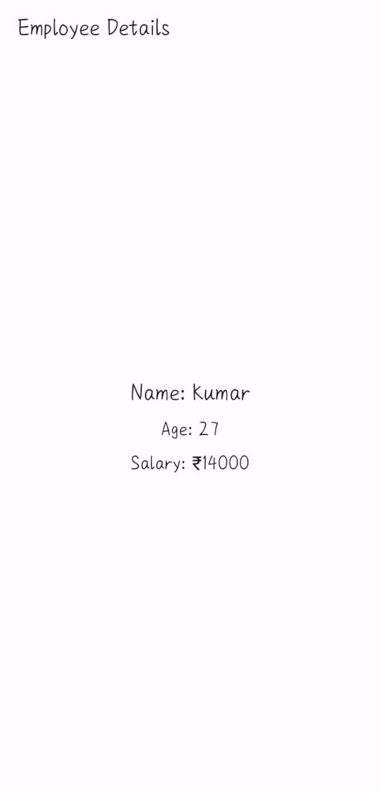

# 📱 Android Employee Directory App

This Android application demonstrates how to fetch JSON data from a remote server, display it in a list view, and show detailed information about each employee in a separate screen when selected. Built using Kotlin, Jetpack Compose, and Retrofit for networking.
---

## ✅ Features

- 🔁 Fetches employee data from a live JSON API
- 📋 Displays data in a scrollable list using LazyColumn
- 👆 On click, navigates to detail screen showing name, age, and salary
- 💻 Clean and modern UI with Material 3 and Jetpack Compose
- ⚙️ MVVM architecture using ViewModel and Retrofit

---

## 🏗️ Tech Stack

- Kotlin
- Jetpack Compose
- Android Studio
- Material 3
- Retrofit

---

## 📸 Screenshots

<table>
  <tr>
    <th>Error Screen</th>
    <th>Final Submitted Screen</th>
  </tr>
  <tr>
    <td></td>
    <td></td>
  </tr>
</table>

---

## 📥 Download Demo App

Want to try it out? Download the APK and install it on your Android device:

👉 [**Download the app**](app-debug.apk)

> Make sure to enable "Install from Unknown Sources" in your phone settings before installing.
---
